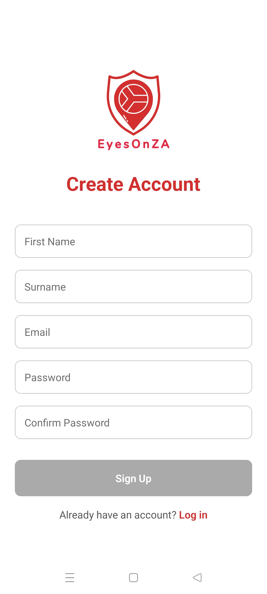

<!-- Logo -->
<p align="center">
  
</p>

<h2 align="center">Community Safety & Incident Reporting App (Expo + Firebase + OpenAI)</h2>

<!-- Badges -->
<p align="center">
  <a href="https://github.com/MichaelaKemp/EyesOnZA/fork" target="_blank">
    
  </a>
  <a href="https://github.com/MichaelaKemp/EyesOnZA/stargazers" target="_blank">
    
  </a>
  <a href="https://github.com/MichaelaKemp/EyesOnZA/commits/main" target="_blank">
    
  </a>
  <a href="https://github.com/MichaelaKemp/EyesOnZA/issues" target="_blank">
    
  </a>
</p>

---

# EyesOnZA

**EyesOnZA** is a South African community safety app developed using **Expo**, **Firebase**, and **OpenAI**. It enables users to report incidents, view activity nearby, and explore safety statistics through a clear, mobile-first interface.

> Development status: In Progress

---

## Table of Contents
- [About the Project](#description)
- [Technologies & Tools](#technologies--tools)
- [Core Features](#core-features)
- [Installation](#installation)
- [Firestore Structure](#firestore-structure)
- [App Flow](#app-flow)
- [Frontend Overview](#frontend-overview)
- [Development Process](#development-process)
- [Final Outcome](#final-outcome)
- [Conclusion](#conclusion)
- [Tools & Libraries](#tools--libraries)
- [Developer](#developer)
- [Licence](#licence)
- [Acknowledgements](#acknowledgements)

---

## Description

EyesOnZA bridges the gap between community awareness and accessible safety reporting. It visualises incidents on an interactive map and uses Vigil, an AI assistant, to guide users through reporting in plain language. Vigil extracts the key details automatically and confirms them before the report is saved to Firestore.

**Who it’s for:** South African communities seeking a simple, transparent, and collaborative way to stay informed about local safety.  
**Why it exists:** To give citizens a collective safety tool that combines location data and AI-driven insight.

---

## Technologies & Tools

<p align="left">
  <a href="https://reactnative.dev/" target="_blank">
    
  </a>
  <a href="https://expo.dev/" target="_blank">
    
  </a>
  <a href="https://firebase.google.com/" target="_blank">
    
  </a>
  
  <a href="https://developers.google.com/maps" target="_blank">
    
  </a>
  <a href="https://www.typescriptlang.org/" target="_blank">
    
  </a>
</p>

---

## Core Features

### Interactive Map
- Displays live community reports on Google Maps.  
- Switch between Heatmap and Marker views.  
- Filter incidents by category such as Theft, Vandalism, or Assault.  
- Includes a pulsing marker showing the user’s location.  
- Quick-access buttons for Vigil Chat, Recentring, and Logout.

### Vigil (AI Assistant)
- Conversational reporting powered by GPT‑5.  
- Extracts essential information including title, time, and location.  
- Confirms each field before saving to Firestore.  
- Redirects the user to the map once their report has been submitted.

### Statistics
- Visual analytics displayed using a Line graph and Pie Chart.  
- Time-based filtering by week, month, year, or all-time.  
- Automatically aggregates categories from the Firestore database.

---

## Installation

### Clone the Repository
```bash
git clone https://github.com/MichaelaKemp/EyesOnZA.git
cd EyesOnZA
```

### Install Dependencies
```bash
npm install
```

### Configure Environment Variables
Create an `.env` file or update your Expo configuration:
```env
OPENAI_API_KEY=your_openai_api_key
GOOGLE_MAPS_API_KEY=your_google_maps_api_key
```

### Run the Development Server
```bash
npx expo start
```

---

## Firestore Structure

```text
/reports
  ├── id (auto)
  ├── title: "Theft"
  ├── description: "Phone stolen at taxi rank"
  ├── location: "Pretoria CBD"
  ├── latitude: -25.7479
  ├── longitude: 28.2293
  ├── category: "Theft"
  ├── incidentTime: Timestamp
  ├── createdAt: serverTimestamp()
  ├── userName: "Anonymous"
  ├── userEmail: "user@example.com"
```

---

## App Flow

1. User logs in and is redirected to the **Map** screen.  
2. Reports load in real-time from Firestore.  
3. The user opens Vigil to create a new report.  
4. AI extracts key details and confirms them.  
5. Once confirmed, the report is saved to Firestore.  
6. The user is redirected back to the map to view it.  
7. The Statistics screen updates automatically with new data.

---

## Frontend Overview

Built with **Expo** and **React Native**, EyesOnZA’s frontend focuses on clarity, accessibility, and performance. Each screen uses consistent branding and spacing, with subtle shadows to highlight important UI areas.

### Screens
- **Login & Signup** — simple Firebase authentication and session handling.  
- **Map Screen** — displays reports with heatmap toggle and filters.  
- **Vigil Screen** — AI-powered conversational reporting.  
- **Report Details Screen** — shows full incident details including time, location, and notes.  
- **Statistics Screen** — visualises reports through time-based analytics.

<p align="center">
  
  
  
</p>

<p align="center">
  
  
  
</p>

---

## Development Process

The development of EyesOnZA combined user-centred design, mobile-first interaction patterns, and real-time data workflows. The goal was to create a safety reporting tool that felt fast, intuitive, and accessible to South African communities. Below is an overview of the creative and technical decisions behind the project.

### System Architecture

EyesOnZA follows a lightweight Expo + Firebase architecture:

- **Frontend:** Expo (React Native), Expo Router  
- **Backend:** Firebase Firestore (NoSQL)  
- **AI Processing:** OpenAI API (Vigil)  
- **Maps & Geocoding:** Google Maps + Places + Geocoding API  
- **Auth:** Firebase Authentication  
- **State Handling:** React hooks + Firestore real-time listeners  
- **Timezone handling:** Luxon configured for South African locale  

This architecture was chosen to ensure smooth deployment, instant syncing of incident data, and compatibility across Android devices without native build complexity.

### Data Flow Overview

1. User input is captured via Vigil (AI chat) or manual form components.  
2. Vigil extracts structured data from natural language using a strict JSON format.  
3. The app validates all fields and sends to Firestore.  
4. Map and Statistics screens subscribe to Firestore changes.  
5. Charts and heatmaps render updates in real-time.  

### AI Assistant (Vigil) – Technical Rationale

Vigil was designed to reduce the cognitive load of reporting an incident:

- Natural language input is parsed into structured fields  
- The model must return strict JSON (title, description, incidentTime, location, category)  
- Additional rules enforce correct time formatting and prevent hallucinated or defaulted dates  
- Vigil confirms each extracted field before saving to Firestore  

This makes reporting accessible even to users unfamiliar with structured form fields.

### Key Technical Decisions

- **Heatmap as well as cluster markers:** Heatmap better visualises community activity density.  
- **Luxon over Moment.js:** Better reliability for timezone logic + SA format handling.  
- **Real-time Firestore listeners:** Ensures reports appear instantly on the map.  
- **Expo Speech:** Adds accessibility for visually impaired users.  
- **Strict AI validation:** Prevents inaccurate or incomplete report entries.

### User Testing

To evaluate usability, clarity, and overall experience, four participants completed a user test using a Google Forms feedback survey. The goal was to understand how intuitive the reporting flow was, whether Vigil’s instructions were clear, and whether users could navigate the app without guidance.

### Confidence & Ease of Use
- 75% of users felt confident using the app without instructions.  
- 25% felt neutral, indicating that a short onboarding screen could further improve clarity.

This shows that the core flow (Map → Vigil → Report) is intuitive even for first-time users.

### Errors & Technical Issues
- 50% reported no errors.
- One user mentioned iOS compatibility issues.
- Others noted missing icons or unclear navigation in early builds.

These responses guided multiple UI fixes and navigation improvements.

### Location Input Feedback
All users found location input **easy or very easy**:

This validates the decision to use Google Maps + automatic geolocation.

### AI Assistant (Vigil) Feedback
- 100% of users said Vigil’s responses were useful and relevant.

This confirms that AI-assisted reporting increases confidence and clarity.

### Navigation & UI Discoverability
- 75% said navigation was clear.
- 25% reported missing or unclear icons during early testing.
- This directly influenced improvements to:
  - Icon visibility

### Requested Features
Users suggested:
- Voice input for urgent/dangerous situations  
- Ability to attach photos  
- Categories or severity indicators  
- A list-view alternative to the map view  
- Group-based or category-based notifications  

These suggestions form the basis of the future improvements roadmap.

### Likelihood of Real-World Use
- 100% of participants said they believe people would actually use the app.

### What Would Encourage Ongoing Use
Users recommended:
- Notifications or pop-ups  
- Update feeds  
- Ability to follow specific groups/regions  
- A sense of community or active contributors  

### Resulting Improvements Implemented
Based on user testing:
- Improved navigation clarity and fixed missing/misaligned icons  
- Roadmap updated to include:
  - Voice input
  - Photo attachments
  - Notifications & groups
  - Optional onboarding screen

User testing confirmed that EyesOnZA is intuitive, AI-assisted reporting is highly effective, and the app has strong potential for real-world adoption.

### Challenges & Solutions

**1. AI extracting incomplete or incorrect report fields**  
Solution: Enforced strict JSON schema + added confirmation dialogues.

**2. Time formatting not matching SA locale**  
Solution: Implemented Luxon with explicit `setZone("Africa/Johannesburg")`.

**3. Reports replacing map markers incorrectly**  
Solution: Added validation + a fallback location handler.

**4. Slow image and map loading on older devices**  
Solution: Deferred heavy operations using `useFocusEffect` and memoisation.

The result is a stable, predictable reporting experience across devices.

---

## Roadmap

- Push notifications for nearby safety reports.  
- Deeper analytics and more advanced filtering options for the Statistics screen.  
- Vigil integration within the Statistics screen for contextual insights.
- Voice input for urgent situations, allowing users to report incidents hands-free.  
- Photo attachments to provide visual evidence or context during reporting.  
- Incident categories and threat levels (e.g., “minor”, “serious”, “avoid area”).  
- List-view of incidents by region, as an alternative to map-only browsing.  
- Group-based or category-based notifications, allowing users to follow specific areas or incident types.  
- Optional iOS-specific optimisations once Expo SDK updates allow feature parity.

---

## Final Outcome

### Demonstration Video

[Demo Video](./assets/demo/demo-video.mp4)

---

## Conclusion

EyesOnZA combines technology, user-centred design, and social purpose. By merging AI-assisted reporting with live community data, the app makes safety information more transparent and accessible. The project demonstrates how thoughtful UX and intelligent systems can encourage civic engagement and shared responsibility within South African communities.

---

## Tools & Libraries

- **Expo** – React Native app development.  
- **Firebase Firestore** – Real-time database for storing reports.  
- **OpenAI GPT‑5** – Core AI model powering Vigil.  
- **Google Maps & Geocoding API** – Map rendering and location lookup.  
- **Luxon** – Timezone handling for South African context.  
- **React Native SVG Charts** – Used for visualising statistics.  
- **Expo Speech** – Adds text-to-speech accessibility features.  


---

## Developer

**Michaela Kemp**  
Student — Open Window, South Africa    

---

## Licence

**Educational Use Disclaimer**  
This project was created as part of coursework for Interactive Development (VC300) at Open Window and is intended for portfolio presentation only.  
Not licensed for redistribution or commercial use.

---

## Acknowledgements

- **OpenAI** — for powering Vigil, the AI assistant.  
- **Expo Documentation** — for navigation, debugging tools, and platform support.  
- **Firebase Documentation** — Firestore and Authentication reference.  
- **Google Maps Platform** — for map rendering and geocoding.  
- **React Native community** — for libraries and troubleshooting resources.  
- **Academic resources** from Open Window to support planning and UX decisions.  
- **ChatGPT (OpenAI)** — for assistance with debugging, documentation, and optimisation during development.

© Michaela Kemp, 2025. All rights reserved.
