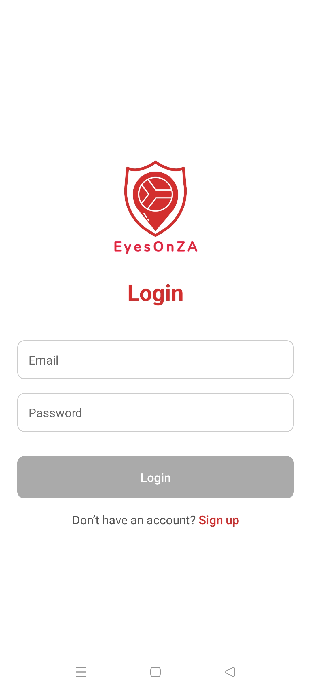
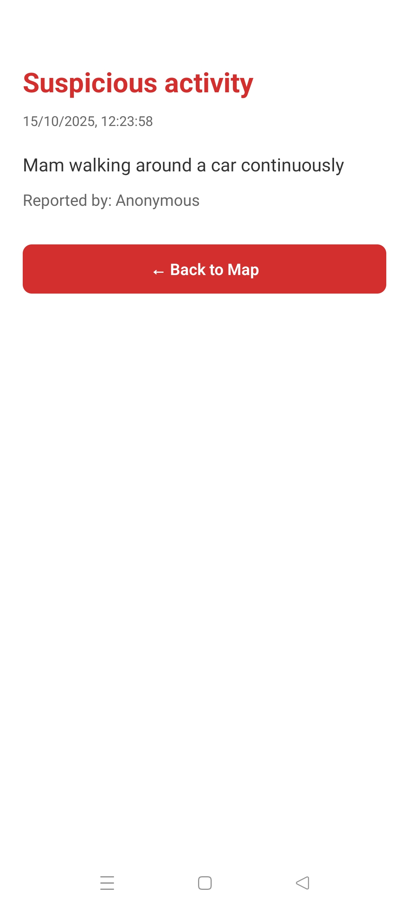
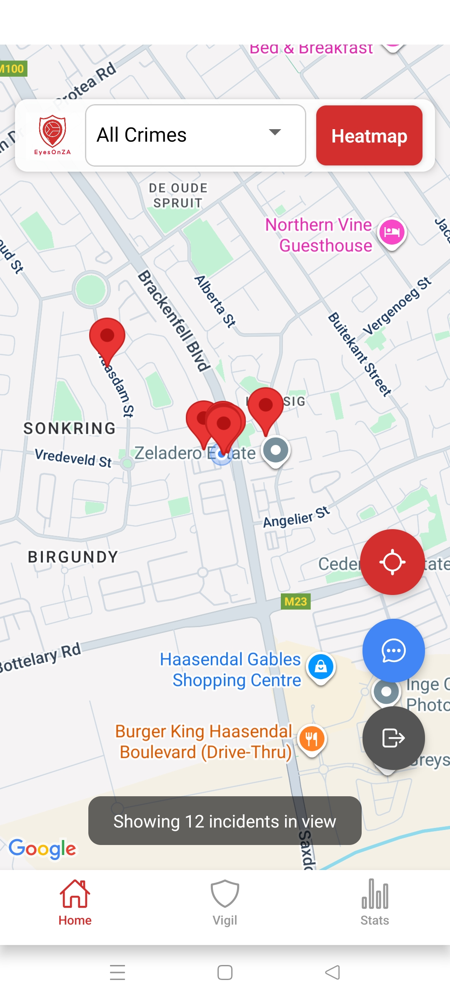
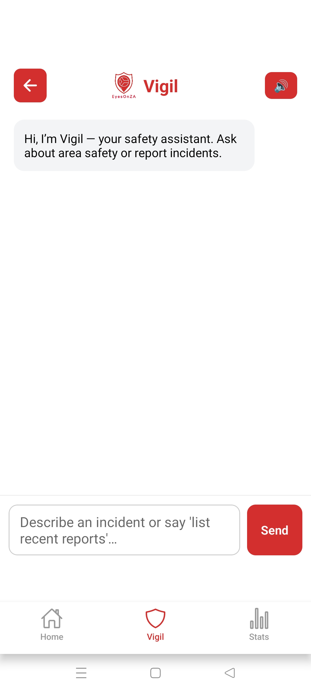
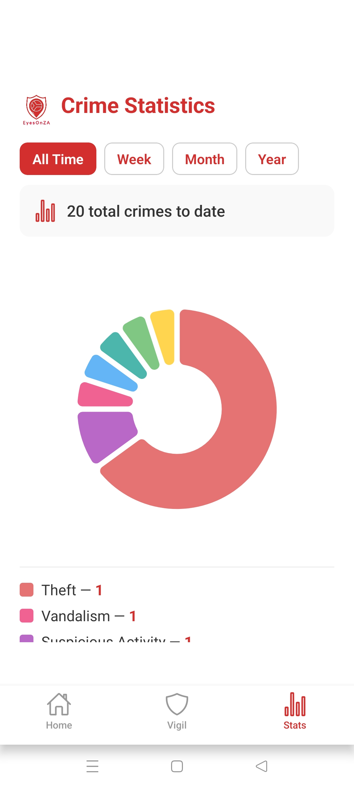

<!-- Logo -->
<p align="center">
  
</p>

<h2 align="center">Community Safety & Incident Reporting App (Expo + Firebase + OpenAI)</h2>

<!-- Badges -->
<p align="center">
  <a href="https://github.com/MichaelaKemp/EyesOnZA/fork" target="_blank">
    
  </a>
  <a href="https://github.com/MichaelaKemp/EyesOnZA/stargazers" target="_blank">
    
  </a>
  <a href="https://github.com/MichaelaKemp/EyesOnZA/commits/main" target="_blank">
    
  </a>
  <a href="https://github.com/MichaelaKemp/EyesOnZA/issues" target="_blank">
    
  </a>
</p>

---

# EyesOnZA

**EyesOnZA** is a South African community safety app developed using **Expo**, **Firebase**, and **OpenAI**. It enables users to report incidents, view activity nearby, and explore safety statistics through a clear, mobile-first interface.

> Development status: In Progress

---

## Description

EyesOnZA bridges the gap between community awareness and accessible safety reporting. It visualises incidents on an interactive map and uses **Vigil**, an AI assistant, to guide users through reporting in plain language. Vigil extracts the key details automatically and confirms them before the report is saved to Firestore.

**Who it’s for:** South African communities seeking a simple, transparent, and collaborative way to stay informed about local safety.  
**Why it exists:** To give citizens a collective safety tool that combines location data and AI-driven insight.

---

## Technologies & Tools

<p align="left">
  <a href="https://reactnative.dev/" target="_blank">
    
  </a>
  <a href="https://expo.dev/" target="_blank">
    
  </a>
  <a href="https://firebase.google.com/" target="_blank">
    
  </a>
  <a href="https://openai.com/" target="_blank">
    
  </a>
  <a href="https://developers.google.com/maps" target="_blank">
    
  </a>
  <a href="https://www.typescriptlang.org/" target="_blank">
    
  </a>
</p>

---

## Core Features

### Interactive Map
- Displays live community reports on Google Maps.  
- Switch between **Heatmap** and **Marker** views.  
- Filter incidents by category such as Theft, Vandalism, or Assault.  
- Includes a pulsing marker showing the user’s location.  
- Quick-access buttons for **Vigil Chat**, **Recentring**, and **Logout**.

### Vigil (AI Assistant)
- Conversational reporting powered by **GPT‑5**.  
- Extracts essential information including title, time, and location.  
- Confirms each field before saving to Firestore.  
- Redirects the user to the map once their report has been submitted.

### Statistics
- Visual analytics displayed using a **Pie Chart**.  
- Time-based filtering by week, month, year, or all-time.  
- Automatically aggregates categories from the Firestore database.

---

## Installation

### Clone the Repository
```bash
git clone https://github.com/MichaelaKemp/EyesOnZA.git
cd EyesOnZA
```

### Install Dependencies
```bash
npm install
```

### Configure Environment Variables
Create an `.env` file or update your Expo configuration:
```env
OPENAI_API_KEY=your_openai_api_key
GOOGLE_MAPS_API_KEY=your_google_maps_api_key
```

### Run the Development Server
```bash
npx expo start
```

---

## Firestore Structure

```text
/reports
  ├── id (auto)
  ├── title: "Theft"
  ├── description: "Phone stolen at taxi rank"
  ├── location: "Pretoria CBD"
  ├── latitude: -25.7479
  ├── longitude: 28.2293
  ├── category: "Theft"
  ├── incidentTime: Timestamp
  ├── createdAt: serverTimestamp()
  ├── userName: "Anonymous"
  ├── userEmail: "user@example.com"
```

---

## App Flow

1. User logs in and is redirected to the **Map** screen.  
2. Reports load in real-time from Firestore.  
3. The user opens **Vigil** to create a new report.  
4. AI extracts key details and confirms them.  
5. Once confirmed, the report is saved to Firestore.  
6. The user is redirected back to the map to view it.  
7. The **Statistics** screen updates automatically with new data.

---

## Frontend Overview

Built with **Expo** and **React Native**, EyesOnZA’s frontend focuses on clarity, accessibility, and performance. Each screen uses consistent branding and spacing, with subtle shadows to highlight important UI areas.

### Screens
- **Login & Signup** — simple Firebase authentication and session handling.  
- **Map Screen** — displays reports with heatmap toggle and filters.  
- **Vigil Screen** — AI-powered conversational reporting.  
- **Report Details Screen** — shows full incident details including time, location, and notes.  
- **Statistics Screen** — visualises reports through time-based analytics.

<p align="center">
  
  
  
</p>

<p align="center">
  
  
  
</p>

---

## Roadmap

- Push notifications for nearby safety reports.  
- Enhanced Google Maps API integration for Vigil (context-aware location suggestions and nearby emergency services).  
- Deeper analytics and filtering options for the statistics view.  
- Vigil integration within the analytics screen for contextual insights.

---

## Conclusion

EyesOnZA combines technology, user-centred design, and social purpose. By merging AI-assisted reporting with live community data, the app makes safety information more transparent and accessible. The project demonstrates how thoughtful UX and intelligent systems can encourage civic engagement and shared responsibility within South African communities.

---

## Tools & Libraries

- **Expo** – React Native app development.  
- **Firebase Firestore** – Real-time database for storing reports.  
- **OpenAI GPT‑5** – Core AI model powering Vigil.  
- **Google Maps & Geocoding API** – Map rendering and location lookup.  
- **Luxon** – Timezone handling for South African context.  
- **React Native SVG Charts** – Used for visualising statistics.  
- **Expo Speech** – Adds text-to-speech accessibility features.  


---

## Developer

**Michaela Kemp**  
Student — Open Window, South Africa    

---

## Licence

**Educational Use Disclaimer**  
This project was created as part of coursework for Interactive Development (VC300) at Open Window and is intended for portfolio presentation only.  
Not licensed for redistribution or commercial use.

© Michaela Kemp, 2025. All rights reserved.
